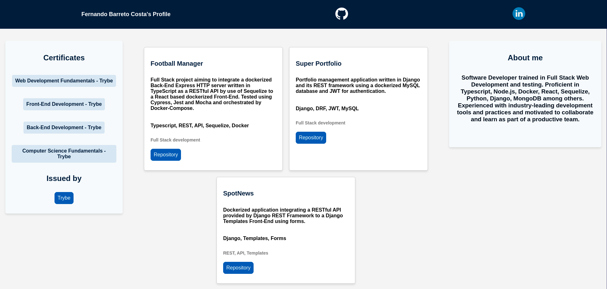
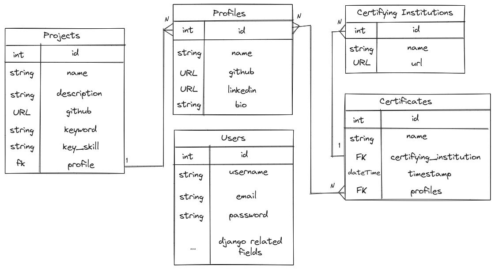

# 📜 Welcome to Django Portfolio
<!-- Olá, Tryber!
Esse é apenas um arquivo inicial para o README do seu projeto.
É essencial que você preencha esse documento por conta própria, ok?
Não deixe de usar nossas dicas de escrita de README de projetos, e deixe sua criatividade brilhar!
:warning: IMPORTANTE: você precisa deixar nítido:
- quais arquivos/pastas foram desenvolvidos por você; 
- quais arquivos/pastas foram desenvolvidos por outra pessoa estudante;
- quais arquivos/pastas foram desenvolvidos pela Trybe.
-->

## What is it

Full Stack project developed as a challenge for the Elective Python module at Trybe Web Development course.

A dockerized application that uses Django Templates to render, in plain HTML and CSS, a Portfolio web site with data sourced from a MySQL database by its REST Framework API through HTTP requests.



A Graphical User Interface is also provided by its administrative panel to facilitate creation, retrieval, modification and deletion of data.

## Tech Stack

| Front-End        | Back-End                | Authentication | HTTP Server | Database | ORM         | Testing       | Packaging |
|:----------------:|:-----------------------:|----------------|:-----------:|:--------:|:-----------:|:-------------:|:---------:|
| Python           | Python                  | JWT            | GUnicorn    | MySQL    | Django      | PyTest        | Docker    |
| Django Templates | Django + REST Framework |                |             |          | MySQLClient | PyTest-Django | PyProject |
|                  |                         |                |             |          |             |               |           |

## Entities

This application leverages a RESTful API to manipulate a database keeping track of:

- Users and credentials
- Profiles containing name, bio and URLs for their GitHub and LinkedIn pages
- Projects and their names, descriptions, URLs, keywords and key skills
- Certificates stating name, issuing institution and creation timestamp
- Certifying Institutions, its names and web pages

Using this data, a Profile rendering endpoint is provided for data visualization in your browser.

### Relationship

These entities are related as shown below:



## How to run this project

1. Clone this repository and enter its directory:

``` shell
git clone git@github.com:fernando-costa/django-portfolio.git && cd django-portfolio/
```

2. Create a virtual environment

``` shell
python3 -m venv .venv && source .venv/bin/activate
```

3. Install dependencies

``` shell
pip install -r requirements.txt
```

4. Create a Docker container for the Database

``` shell
docker build -t super-portfolio-db .
docker run -d -p 3306:3306 --name=super-portfolio-mysql-container -e MYSQL_ROOT_PASSWORD=password -e MYSQL_DATABASE=super_portfolio_database super-portfolio-db
```

5. Migrate and populate database

``` shell
python3 manage.py makemigration && python3 manage.py migrate
```

6. Create a superuser

``` shell
python3 manage.py createsuperuser
```

7. Start server

``` shell
python3 manage.py runserver
```

8. Visit http://localhost:8000/admin

Use your credentials to create a Profile, some Projects, Certifying Institutions and their Certificates.

9. Visit http://localhost:8000/profiles/1

Admire the newly created Portfolio web page rendered with your inputted information!

